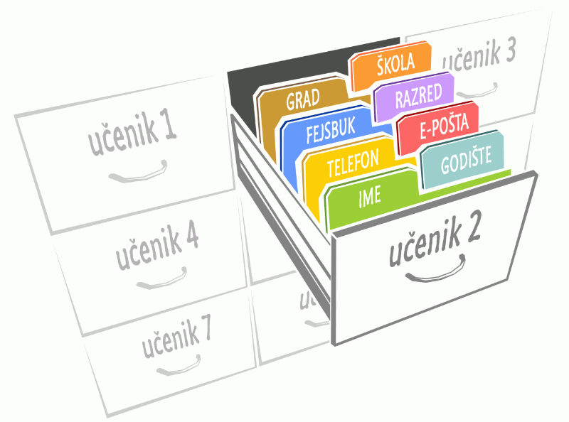
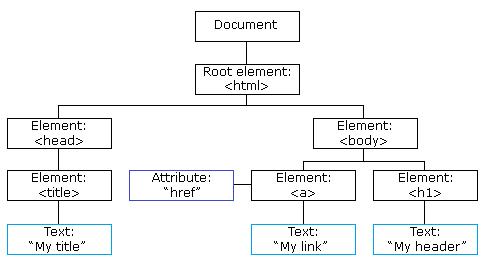

Објекти
=======

У претходним примерима смо се сусретали са променљивама које имају једноставне вредности. Свака променљива има у себи само један податак, који може да буде број, текст, итд. (такозвани прости типови). Међутим, често je потребно користити сложеније структуре података, које у себи садрже по неколико једноставнијих вредности. На пример, да би се сачувале информације о особи, згодно је податке као што су име, презиме, датум рођења и слично објединити у једну целину. У ту сврху користе се објекти. 

Објекат је вредност сложеног типа, коју можемо замислити као групу именованих вредности. Замислите да у програму желимо да користимо разне податке о неком ученику, као што су његово име, старост, град у коме живи, број телефона, имејл, контакт на некој друштвеној мрежи, школу и разред у који иде. Уместо да употребимо осам засебних променљивих за ове податке, могли бисмо да групишемо ове податке и ставимо их у једну променљиву. Такве променљиве можемо да правимо и за друге ученике:

У језику *JavaScript* се овакви објекти праве тако што се у витичасте заграде ставе имена поља и вредности које ће бити у тим пољима:

.. code-block:: javascript

    var ucenik1 = { ime: "Петар Петровић", godiste: 1998, telefon: "012 345 678" }
    var ucenik2 = { ime: "Марко Марковић", godiste: 1997, telefon: "098 765 432" }

Направили смо две променљиве (``ucenik1`` и ``ucenik2``) које садрже објекте. Имена поља морају да буду у складу са правилима именовања променљивих у *JavaScript*-у (тј. почињу словима, доларом или доњом цртом, а после могу да садрже и цифре), а вредности могу да буду бројеви, стрингови или вредности било којег другог типа, укључујући и друге објекте.

Објекат можемо да направимо и тако што почнемо од потпуно празног објекта

.. code-block:: javascript

    let x = {};

a касније таквом објекту додајемо поља.

.. code-block:: javascript

    x.polje = vrednost;

Пољима у објекту се може приступити по имену коришћењем тачке (нпр. ``имеОбјекта.имеПоља``). У следећем примеру можете да видите како се прави објекат, како се чита податак из њега и како се уписује вредност у неко поље објекта.

.. activecode:: azuriranje_objekta_1_js
    :language: javascript
    :nocodelens:

    let ucenik = { ime: "Петар Петровић", tel: "012 345 678", razred: 6 };
    let razred = ucenik.razred;
    razred = razred + 1;
    ucenik.razred = razred;
    alert(ucenik.razred);
    
У овом случају, вредност објекта је могла да буде промена и једноставније:

.. activecode:: azuriranje_objekta_2_js
    :language: javascript
    :nocodelens:

    let ucenik = { ime: "Петар Петровић", tel: "012 345 678", razred: 6 };
    ucenik.razred++;
    alert(ucenik.razred);

Објектни модел документа стране
-------------------------------

У лекцијама о језику *HTML* смо видели да *HTML* кôд дефинише структуру стране у којој се налази заглавље са насловима и тело са различитим *HTML* елементима. 

У *JavaScript* коду који се извршава у веб странама се може користити један специјалан објекат који се зове *document*. Овај објекат нам омогућава да приступимо *HTML* елементима који се налазе у веб страни и да их читамо и мењамо. Када лоцирамо неки објекат, који представља неки *HTML* елемент у страни, можемо да га променимо тако што му на пример променимо *CSS* стил.

.. activecode:: boja_teksta_html_js
    :language: html
    :nocodelens:

    <!DOCTYPE html>
    <html>
      <head>
      </head>
      <body>
        
        
Боја слова и позадине овог текста је постављена JavaScript наредбом.

      </body>
    </html>

.. activecode:: novi_tekst_html_js
    :language: html
    :nocodelens:

    <!DOCTYPE html>
    <html>
      <head>
      </head>
      <body>
        
Обичан <i>HTML</i> параграф.

        
      </body>
    </html>

.. activecode:: nova_lista_html_js
    :language: html
    :nocodelens:

    <!DOCTYPE html>
    <html>
      <head>
      </head>
      <body>
        
Обичан <i>HTML</i> параграф.

        
      </body>
    </html>

