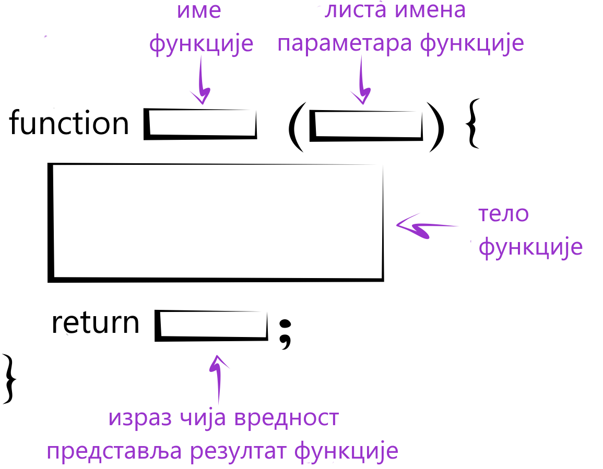
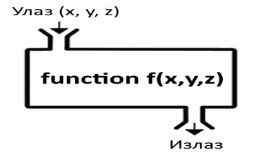

Функције
========

У програмима који решавају сложеније проблеме, групу наредби које решавају неки подзадатак можемо да издвојимо у целину која се зове функција. Функција има своје име и позивом функције по имену се извршавају наредбе у тој функцији.

У језику *JavaScript* се функције креирају тако што се иза имена функције у облим задградама наведе листа праметара, а затим у витичастим заградама скуп наредби које треба извршити када се та функција позове. 

Параметри су вредности које можемо да пошаљемо функцији када је позовемо. Функција на основу параметара може (а не мора) да врати неки резултат помоћу наредбе *return*. У следећих пар примера ћемо видети како се пишу и позивају функције које враћају резултат:

.. questionnote::

    **Пример - сложено кретање 1**
    
    Позната је брзина тела у појединим тренуцима:

    - у тренутку :math:`t_0 = 0 s`, брзина је била :math:`V_0 = 2 {m \over s}`
    - у тренутку :math:`t_1 = 4 s`, брзина је била :math:`V_1 = 11 {m \over s}`
    - у тренутку :math:`t_2 = 11 s`, брзина је била :math:`V_2 = 13 {m \over s}`
    - у тренутку :math:`t_3 = 14 s`, брзина је била :math:`V_3 = 5 {m \over s}`

    Написати програм који израчунава пут који је ово тело прешло, претпостављајући да се брзина између контролних тачака мењала равномерно.

Уз нешто знања физике не би требало да буде тешко да се разуме дато решење:

.. activecode:: slozeno_kretanje_1_js
    :language: javascript
    :nocodelens:

    function put(tPoc, tZav, vPoc, vZav) {
        let t = tZav - tPoc;
        let vsr = (vPoc + vZav) / 2;
        let predjeniPut = vsr * t;
        return predjeniPut;
    }

    // дати подаци
    let t0 = 0, t1 = 4, t2 = 11, t3 = 14;
    let v0 = 2, v1 = 11, v2 = 13, v3 = 5;

    let s1 = put(t0, t1, v0, v1);
    let s2 = put(t1, t2, v1, v2);
    let s3 = put(t2, t3, v2, v3);
    alert(`Укупан пређени пут је ${(s1+s2+s3).toFixed(2)}.`);

Када је поребно да функција врати више од једног резултата, те резултате можемо да наведемо у угластим заградама. Променљиве које примају враћене вредности на месту позива функције такође наводимо у угластим заградама.

.. questionnote::

    **Пример - сложено кретање 2**
    
    Тело које је на почетку у мировању, креће се све време у истом смеру на следећи начин:

    - најпре 3 секунде равномерно убрзава убрзањем од :math:`2 {m \over s^2}`;
    - затим се креће сталном брзином током наредних 10 секунди;
    - на крају равномерно успорава убрзањем од :math:`-6 {m \over s^2}` до заустављања.
    
    Написати програм који израчунава пут који је ово тело прешло.

.. activecode:: slozeno_kretanje_2_js
    :language: javascript
    :nocodelens:

    function putIZavrsnaBrzina(t, v0, a) {
        let v1 = v0 + a*t;       // брзина после t секунди (завршна)
        let vsr = (v0 + v1) / 2; // средња брзина
        put = vsr * t;           // пређени пут
        return [put, v1];
    }

    // дати подаци
    let t1 = 3, v0 = 0, a1 = 2, t2 = 10, a2 = 0, a3 = -6;
    
    let [s1, v1] = putIZavrsnaBrzina(t1, v0, a1);
    let [s2, v2] = putIZavrsnaBrzina(t2, v1, a2);
    let t3 = v2 / Math.abs(a3);
    let [s3, v3] = putIZavrsnaBrzina(t3, v2, a3);
    alert(`Укупан пређени пут је ${(s1+s2+s3).toFixed(2)}.`);

.. questionnote::

    **Пример - честитка и коверта**
    
    Написати програм који прихвата димензије честитке и коверте, а затим исписује да ли честитка може да стане у коверту. 
    
    Подразумева се да странице честитке у коверти треба да буду паралелне страницама коверте.
    
    .. image:: ../../_images/js/Koverta-Pravila.png
        :width: 500px
        :align: center

.. comment

    Dimenzije koverti:
    
    Ameriken    230 x 110 mm
    B5          250 x 175 mm
    C4          330 x 230 mm
    C5          229 x 162 mm
    B4          353 x 250 mm
    E4          400 x 280 mm
    A5+         230 x 160 mm
    B5+         260 x 190 mm
    A4+         330 x 230 mm
    B4+         360 x 260 mm

Честитка може да стане у коверту на два начина, као што показује слика. Та два начина можемо да сведемо на један, ако обзбедимо да је и код честитке и код коверте прва димензија мања а друга већа (или су једнаке). Након тога је довољно проверити да ли је прва димензија честитке мања од прве димензије коверте а друга димензија честитке мања од друге димензије коверте.

Функцја *poRedu* прихвата два параметра и враћа их редом по величини (први резултат једнак је мањем од два параметра, а други већем).

.. activecode:: koverta_i_cestitka_js
    :language: javascript
    :nocodelens:

    function poRedu(a, b) {
        if (a > b) {
            let t = a;
            a = b;
            b = t;
        }
        return [a, b];
    }

    let cestitka_a = parseInt(prompt(`Ширина честитке:`));
    let cestitka_b = parseInt(prompt(`Дужина честитке:`));
    let koverta_a = parseInt(prompt(`Ширина коверте:`));
    let koverta_b = parseInt(prompt(`Дужина коверте:`));

    [cestitka_a, cestitka_b] = poRedu(cestitka_a, cestitka_b);
    [koverta_a, koverta_b] = poRedu(koverta_a, koverta_b);

    if (cestitka_a < koverta_a && cestitka_b < koverta_b) {
        alert('Честитка може да стане у коверту');
    } else {
        alert('Честитка не може да стане у коверту');
    }

~~~~
    
Функције у претходним примерима на основу датих параметара израчунавају неки резултат и враћају га на место позива:

Функција, међутим, може да буде и без параметара, а у том случају се после имена функције пишу само обле заграде. Такође, функција не мора ни да врати резултат. У следећем примеру се појављује функција која нема параметре и не враћа резултат (функције које не враћају резултат се понекад називају процедуре).

.. questionnote::

    **Пример - време отварања веб странице**
    
    Направити веб страницу, која по отварању јавља у колико сати је отворена.

Једно могуће решење је:

.. activecode:: tacno_vreme_js
    :language: html
    :nocodelens:
    
    <!DOCTYPE html>
    <html>
    <head>
      
      <title>Време</title>
    </head>
    <body>
        
Садржај стране.<\p>
    </body>
    </html>

У случају да функција нема у себи наредбу ``return``, или ако би у њој писало само ``return;`` без вредности која се враћа, позив функције пишемо као наредбу

.. code-block:: javascript

    prikaziTacnoVreme();

Ако бисмо "вредност" такве функције грешком доделили некој променљивој

.. code-block:: javascript

    let x = prikaziTacnoVreme();

не би дошло до синтаксне грешке или пуцања програма, него би само та променљива добила специјалну вредност ``undefined``. Ову вредност имају и декларисане а неиницијализоване променљиве:

.. code-block:: javascript

    let n;
    var m;

Вредност ``undefined`` треба схватити као одсуство вредности.
