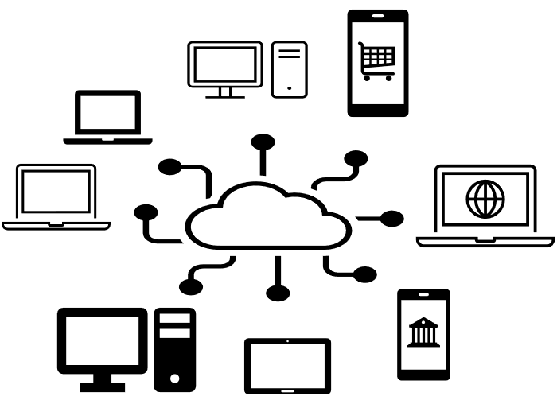
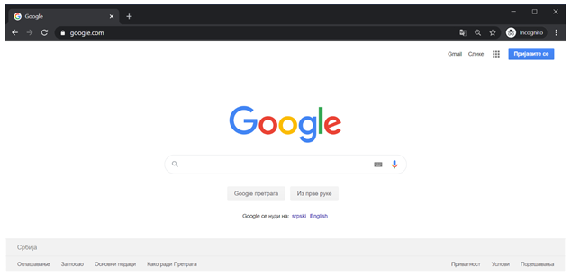
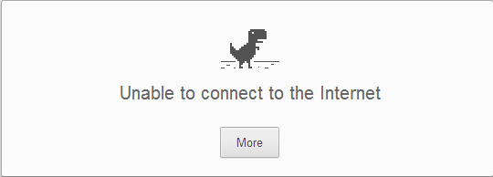

Информатика за трећи разред гимназије
-------------------------------------

Интернет је велика међународна информациона мрежа која омогућава рачунарима, таблетима, телефонима и другим уређајима који су повезани на ову мрежу да међусобно комуницирају. Било који уређај који је повезан на интернет може да шаље или прима податке од других уређаја.

Уређаји које најчешће користимо како би се повезали на интернет су класични рачунари, лаптопови, таблети и мобилни телефони. Ови уређаји су повезани на интернет или директно преко кабла или бежично (*WiFi*).

Најчешће користимо програме који се зову прегледачи (нпр. *Google Chrome*, *FireFox*, *Microsoft Edge*) који су инсталирани на нашим уређајима како бисмо приступили неким удаљеним рачунарима на којима се налазе подаци које желимо да видимо. У прегледачима морамо да унесемо такозвану *URL* адресу (енгл. *Unified Resource Location*) на којој се налазе неки подаци које желимо да добијемо од неког рачунара на интернету. Примери URL адреса које се често користе су:

- `google.com <https://www.google.com/>`_ ради претраге информација које се могу наћи на интернету.
- `youtube.com <https://www.youtube.com>`_ ради приказивања филмова, или видео снимака.
- `wikipedia.org <https://www.wikipedia.org/>`_ која представља велику бесплатну енциклопедију информација.
- `gmail.com <https://www.gmail.com>`_ ради слања и примања електронске поште помоћу Google Gmail сервиса.

Ако сте повезани на интернет и у прегледач унесете неку од ових адреса (нпр. `<https://www.google.com>`_), приказаће вам се такозвана веб страна која се налази на тој адреси, на пример:

У случају да ваш уређај није повезан на интернет и покушате да приступите неком сајту, вероватно ћете добити овакву грешку:

У овом случају је потребно да се повежете на интернет. 

Интернет се најчешће користи како би се пронашлe неке информације на веб странама. Да би то било могуће, потребно је да неко направи те веб стране и стави информације у њих. У наставку ћете научити како да направите овакве веб стране и прикажете их у прегледачима.

Потребне ствари за курс:

- Едитор текста.
- Инсталиран веб прегледач.

Садржај
-------

.. toctree::
   :maxdepth: 2

   1_html/toctree.rst
