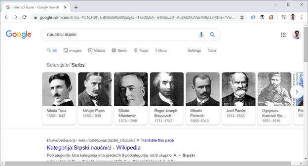

Повезивање докумената
=====================

У обичном тексту у књигама и *Word* документима прелазите са стране на страну и читате га секвенцијално (редом). На веб странама имате могућност да током читања лако прелазите на друге делове текста у зависности од интереса, вратите се назад и наставите током који вас највише занима.

Једна од најбитнијих идеја језика *HTML* је да омогући тзв. **хипер-текст** – текст који може да се чита различитим редом, зависно од интересовања читаоца.

Хипер-текст је толико битан елемент језика *HTML*, да је постао и део самог назива језика - “Hyper-Text Markup Language”. *HTML* документи вам омогућавају да поделите садржај на више фајлова како би читалац могао да пролази кроз садржаје који га интересују на начин који му одговара. На овај начин, *HTML* документи постају много више од обичних страна које можете наћи у књигама. Као пример, погледајмо како Google приказује резултате претраге када се траже информације о српским научницима.

Након што пронађе податке о неким српским научницима, *Google* неће приказати страну на којој детаљно описује све те научнике, него само имена и слике научника које је пронашао. Поред тога, *Google* ће вам омогућити да одаберете име научника о коме више желите да сазнате, а по вашем избору ће се приказати нова страна са информацијама о научнику којег сте одабрали. 

Конкретније, *Google* приказује *HTML* документ који садржи везе (линкове) ка странама на којима можете да прочитате више информација о научнику за кога сте заинтересовани.

Као што *Google* може да постави овакве везе када прикаже резултате претраге, и ви можете да урадите исто у својим странама. Замислимо да смо поред стране о *Николи Тесли* (NikolaTesla.html) направили и стране о *Михајлу Пупину* (MihajloPupin.html) и *Милутину Миланковићу* (MilutinMilankovic.html) и да желимо да направимо страну на којој ће читалац моћи да одабере који од ових докумената жели да прочита. Потребно је да текст на који ће читалац да кликне окружимо ``<a>`` елементом. Унутар почетне ознаке елемента ``<a>`` пишемо и атрибут``href``, чија вредност је име *HTML* документа којег треба приказати када читалац кликне на текст унутар елемента:

.. code-block:: html

    <a href="NikolaTesla.html">Никола Тесла</a> 
    <a href="MihajloPupin.html">Михајло Пупин</a> 
    <a href="MilutinMilankovic.html">Милутин Миланковић</a>

Елемент ``<a>`` омогућава читаоцу да одабере (кликне, тапне) на текст унутар ``<a>`` елемента и том акцијом пређе на *HTML* документ који је наведен као вредност ``href`` атрибута. На овај начин можемо да направимо везе од једног *HTML* документа ка осталима.

.. comment

    ovde se priča o atributima kao da se prvi put pominju, a bilo je pominjanja atribura za jezik dokumenta.

.. infonote::

    НОВО: Овде можете да приметите још један нови концепт у *HTML* елементима – **атрибут**. У претходним примерима, ознаке које су се користиле да обележе почетак елемента су се завршавале симболом ``>`` - ништа се није стављало у почетну ознаку сем имена саме ознаке. Језик *HTML* вам омогућава да сваки елемент додатно опишете атрибутима, који се пишу у облику *атрибут1="вредност1"* *атрибут2="вредност2"* итд. У овом примеру, атрибут ``href`` описује на коју *HTML* страну треба прећи када се кликне на текст.

*HTML* документи који се користе у претходном примеру се налазе у истом директоријуму као и документ у коме се налазе *HTML* елементи ``<a>``. Међутим, ништа вас не спречава да фајлове распоредите по посебним директоријумима и да их повежете. На пример, претпоставимо да су стране о научницима у под-директоријуму *naucnici*, стране о фудбалерима у под-директоријуму *fudbaleri*, а стране о кошаркашима у под-директоријуму *kosarkasi*. Ако бисте хтели да повежете своју страну са њима, могли бисте да користите линкове приказане у следећем примеру:

.. code-block:: html

    <a href="naucnici/NikolaTesla.html">Никола Тесла</a> 
    <a href="naucnici/MihajloPupin.html">Михајло Пупин</a> 
    <a href="naucnici/MilutinMilankovic.html">Милутин Миланковић</a>
    <a href="fudbaleri/DragoslavSekularac.html">Драгослав Шекуларац</a> 
    <a href="fudbaleri/DejanStankovic.html">Дејан Станковић</a> 
    <a href="fudbaleri/DraganMance.html">Драган Манце</a> 
    <a href="fudbaleri/SasaIlic.html">Саша Илић</a> 
    <a href="kosarkasi/BoraStankovic.html">Бора Станковић</a>
    <a href="kosarkasi/SasaDjordjevic.html">Саша Ђорђевић</a> 

Ово су такозвани **релативни линкови**, који вам омогућавају да одведете читаоца од тренутне стране ка другој страни. У претходном примерима се референцирају стране које се налазе у под-директоријумима, али релативни линкови вам омогућавају и да пређете у над-директоријум коришћењем две тачке ``..``, које представљају директоријум на вишем нивоу. На пример, замислимо да се читалац налази на страни ``fudbaleri/DraganMance.html`` и да желимо да га одведемо на страну ``kosarkasi/SasaDjordjevic.html`` када одабере линк. На страни ``fudbaleri/DraganMance.html`` бисмо ставили следећи релативни линк:

.. code-block:: html

    <a href="../kosarkasi/SasaDjordjevic.html">Саша Ђорђевић</a> 

Поред докумената који се налазе у различитим директоријумима у оквиру тренутног сајта, можете направити везе ка странама које се налазе на потпуно другим веб сајтовима (као што то ради *Google* у највећем броју случајева). У том случају би требало да ставите пун *URL* који стављате и у прегледачу када желите да одете на неку страну. Документ са везама ка странама *Википедије* је приказан у следећем примеру:

.. code-block:: html

    <a href="https://sr.wikipedia.org/sr-ec/Борислав_Станковић">Борислав Станковић</a>

Ово су такозвани **апсолутни линкови**, помоћу којих се задаје пуна *URL* адреса до жељене стране. Једна од најчешћих грешака које се праве је изостављање *http://* префикса у апсолутном линку као што је приказано у следећем примеру:

.. code-block:: html

    <a href="sr.wikipedia.org/sr-ec/Борислав_Станковић">Борислав Станковић</a>

Могуће је да сте навикли да пишете *URL* адресе без *http://* префикса, пошто ће их прегледачи аутоматски додати. Међутим, то се неће десити у случају ``<a>`` елемената. Ако ставите вредност *href* атрибута без овог префикса, прегледач ће сматрати да желите да отворите локални фајл *Борислав_Станковић*, који се налази унутар фолдера ``sr.wikipedia.org/sr-ec``. Префикс *http://* у вашој *HTML* референци говори прегледачу да треба да потражи референцирани документ на другом веб сајту, а не локално. Зато ћете у већини случајева добити грешку ако изоставите овај префикс.

Интерни линкови
---------------

У неким случајевима ће вам бити потребно да направите везе које не воде ка другим странама, него ка секцијама унутар тренутне стране. Најчешћи пример у коме би вам ово било потребно је прављење садржаја на почетку стране. На следећој слици је приказан садржај стране о Бориславу Станковићу са линковима ка различитим секцијама (*Биографија*, *Остало*, *Референце*, *Литература*, *Спољашње везе*) на истој веб страни о овом славном кошаркашу, тренеру и кошаркашком функционеру:

.. image:: ../../_images/html/wiki_borislav_stankovic.png
    :width: 600px
    :align: center

Ако одаберете било који од ових линкова, нећете прећи на нову страну на којој можете наћи више информација. Уместо тога, прегледач ће вас само позиционирати на део тренутне стране где се налазе информације које желите да прочитате. Да бисте могли да користите интерне линкове потребно је да урадите следеће:

- Уведите идентификаторе *HTML* елемената на које омогућавате прелазак (нпр. *биографија*, *референце* итд. у претходној слици) и обележите елементе тим идентификаторима.
- Направите линкове који референцирају те обележене елементе и од њих формирајте садржај.

Елементи се могу јединствено идентификовати помоћу тзв. идентификатора, који су задати као вредности у *id* атрибуту *HTML* елемента. На пример, ако имамо више наслова у документу, сваком од њих можемо да доделимо идентификатор тако што ставимо неку вредност у атрибут ``id`` сваког наслова:

.. code-block:: html

    <h1 id="biografija">Биографија</h1>
    
...

    <h1 id="ostalo">Остало</h1>
    
...

    <h1 id="reference">Референце</h1>
    
...

    <h1 id="literatura">Литература</h1>
    
...

    <h1 id="spoljasnje">Спољашње везе</h1>
    
...

Идентификатори треба да буду јединствени у страни, тако да прегледач може да идентификује тачно један елемент на кога треба прећи по захтеву читаоца. Када дефинишемо идентификаторе, потребно је направити ``<a>`` елементе који упућују читаоца на њих. Ово се постиже тако што се као вредност атрибута href стави **идентификатор секције** на коју треба прећи, са знаком # на почетку:

.. code-block:: html

    <a href="#biografija">Биографија</a> 
    <a href="#ostalo">Остало</a> 
    <a href="#reference">Референце</a> 
    <a href="#literatura">Литература</a> 
    <a href="#spoljasnje">Спољашње везе</a> 

Ако се одабере линк о биографији, прећи ће се на елемент са идентификатором *biografija*.

У претходном примеру су коришћене интерне везе ка секцијама у тренутној страни. У случају да нам је потребно да усмеримо читаоца на одређену секцију у оквиру неке друге стране, можемо да комбинујемо линкове ка другим странама и идентификаторима како бисмо водили читаоца на тачно одређену позицију у документу уместо да га увек поставимо на почетак документа.

.. code-block:: html

    <a href="https://sr.wikipedia.org/sr-ec/Борислав_Станковић#biografija">Биографија</a> 
    <a href="https://sr.wikipedia.org/sr-ec/Борислав_Станковић#ostalo">Остало</a> 
    <a href="https://sr.wikipedia.org/sr-ec/Борислав_Станковић#reference">Референце</a> 

Ако читалац одабере први линк, прегледач ће га одвести на Википедија страну o Бори Станковићу, али уместо да прикаже почетак стране - `<https://sr.wikipedia.org/sr-ec/Борислав_Станковић>`_, позиционираће се на секцију о биографији Боре Станковића - `<https://sr.wikipedia.org/sr-ec/Борислав_Станковић#biografija>`_.

.. comment

    objasniti da kad kad hoveruješ iznad linka, možeš da vidiš URL u status baru - primer - slika