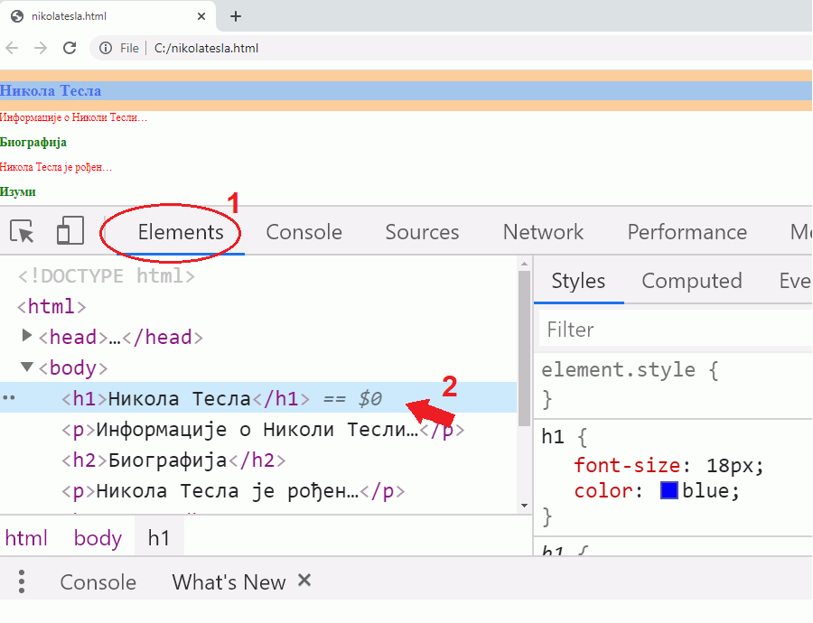

CSS стилови
===========

Ако распоредите *HTML* елементе у документу као што је описано у претходним лекцијама, ти елементи ће бити постављени један испод другог и прегледач ће користити неке подразумеване стиловe (боје, величине слова, размаке) како би их приказао.

Елементе на правим веб странама је често потребно распоредити и стилизовати у складу са наменом сајта. **Веб дизајн** је активност којом се описује како ће страна и елементи на њој изгледати. Веб дизајн је тесно повезан и са другим областима дизајна као што је организација информација на сајту и правила за једноставно коришћење сајта (енгл. *User Experience*).

Као што је *HTML* језик којим се описује структура и садржај елемената који ће бити приказани на веб страни, тако постоји и посебан језик који се користи за описивање изгледа и геометријског распореда ових елемената. Овај језик се назива *CSS* (енгл. Cascading Style Sheets).

Језиком *CSS* се представљају правила која дефинишу како треба да изгледају елементи на веб страни. На пример, на језику *CSS* се *HTML* елементима додељују својстава као што су ``color``, ``background-color`` и слично, како би се дефинисало којом бојом треба приказати текст у елементу, или која ће бити боја позадине. 

У сваком веб прегледачу можете да пронађете *HTML* код било ког елемента приказане веб стране и да испитате која својства има тај елемент и зашто баш тако изгледа, као што се види на следећој слици:

.. comment

    ova slika treba ponovo da se napravi - smanjiti sirinu prozora i zumirati

|

Ако отворите било коју страну у прегледачу *Chrome* и притиснете тастер *F12*, отвориће се део који показује *HTML* кôд којим је описана структура елемената стране као и стилови који су примењени на те елементе да би се добио жељени изглед стране.

Изглед плавог дугмета на претходној слици може да се дефинише на више начина. Један од начина да се опише изглед овог дугмета је приказан у следећем примеру:

.. code-block:: css

  background-color: blue;
  font-size: 12px;
  color: white;

Овако изгледа скуп подешавања стила. У сваком подешавању се са леве стране двотачке налази име својства које треба подесити, а са десне вредност. У примеру се дефинише да ће боја позадине бити плава, величина фонта 12 пиксела а боја фонта бела.

Прегледачи имају неке предефинисане стилове за велики број *HTML* елемената, да би знали како да их прикажу ако стил није прецизиран. У случају да нам ти предефинисани стилови не одговарају, ми увек можемо да дефинишемо своје стилове којима ћемо описати како стране прегледача треба да изгледају. Елементи веб стране на претходној слици су, на пример, стилизовани на посебан начин CSS стиловима. 

Дефинисање *CSS* стилова
------------------------

Изглед *HTML* елемената се може дефинисати на више начина. Препоручени начин дизајна модерних веб страна је формирање одвојеног *CSS* фајла који садржи дефиниције стилова. У *HTML* фајлу се на одговарајући начин наводи име једног или више *CSS* фајлова, чији стилови ће бити примењени на елементе наведене у *HTML* фајлу. Овим се обезбеђује конзистентан изглед свих страна у великим сајтовима, јер више *HTML* фајлова може да укључи исти *CSS* документ, па више веб страна користи исти стил дефинисан на једном месту - у *CSS* документу.

Повезивање *CSS* фајла са *HTML* документом je слично (међусобном) повезивању *HTML* докумената помоћу елемената ``<a>``, када се при дефинисању везе наводи локација документа на који треба прећи ако читалац одабере линк. У случају повезивања са *CSS* фајлом је потребно користити елемент ``<link>``, којим се у *HTML* документу дефинише где се налази *CSS* фајл са стиловима.

.. code-block:: html

    <!DOCTYPE html>
    <html>
        <head>
          <link rel="stylesheet" href="stilovi.css">
        </head>
        <body>

        </body>
    </html>

Атрибут ``href`` у овом елементу представља име фајла, који садржи дефиниције стилова које ће бити примењене на елементе у документу. Прегледач чита *CSS* правила из наведеног фајла и у складу са њима приказује *HTML* елементе у *HTML* документу.

.. image:: ../../_images/css/html-css-fajlovi.png
    :width: 648px
    :align: center

Адресе *CSS* докумената се наводе на исти начин као и адресе екстерних *HTML* докумената у ``href`` атрибуту елемента ``<a>``. Вредности могу бити релативне адресе ка *CSS* документима на истом сајту, или апсолутне адресе, које најчешће референцирају *CSS* документе на неком другом сајту.

Као што се у елементима ``<a>`` могу користити апсолутни линкови ка удаљеним фајловима, наш документ може да буде повезан са неким *CSS* фајлом ван нашег сајта, којим се дефинишу стилови, на пример:

.. code-block:: html

    <!DOCTYPE html>
    <html>
        <head>
          <link rel="stylesheet" href="https://maxcdn.bootstrapcdn.com/bootstrap/4.3.1/css/bootstrap.min.css">
        </head>
        <body>

        </body>
    </html>

Апсолутни линкови се често користе у случају да је фајл са стиловима јавно доступан на неком сајту и желите да директно искористите те стилове уместо да копирате тај фајл у ваше локално окружење. Довољно је само да ставите ``<link>`` елемент који садржи локацију *CSS* фајла, као у претходном примеру . Мана оваквог приступа је то што је чак и за веб стране сачуване на вашем рачунару за правилан приказ потребан приступ интернету.

~~~~

Поред референцирања стилова смештених у посебан фајл помоћу елемента ``<link>``, стилови могу да се дефинишу и у самом *HTML* документу помоћу елемента ``
        </head>
        <body>
            <h1> Наслов </h1>
            
 Неки текст. 

        </body>
    </html>

Овако дефинисани стилови се могу применити само на елементе *HTML* документа у коме су наведени. 

Такође, могуће је дефинисати стил појединих елемената стране додавањем атрибута ``style`` у сам *HTML* елемент, на пример:

.. code-block:: html

    

        Неки текст.
    

Употреба *HTML* елемента ``<style>`` у заглављу веб стране и атрибута ``style`` у њеним елементима **се данас сматра лошом праксом и не треба их користити при дизајнирању сајтова**. Овакав начин задавања стила може узроковати неконзистентност у изгледу страна и захтева експертско знање да би се идентификовали проблеми. Овај приступ је имао више смисла у почетку развоја веба, када је због спорог интернета било важно да се све што је потребно за дефинисање изгледа и садржаја стране налази у једном фајлу, и када су сајтови били мањи и једноставнији него данас.

Овај начин дефинисања стилова може бити погодан за једноставне примере, у којима се у једном документу у потпуности дефинише и структура и изглед стране. Ми овај начин нећемо користити у наставку, али на сајтовима као што је *W3CSchools* може се наћи много малих примера са оваквим задавањем стила.

У примерима у овом курсу ће се користити само препоручени начин рада, а то је држање *CSS* кода у посебном фајлу.
