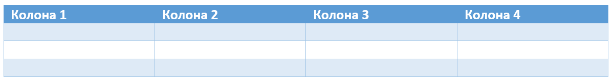
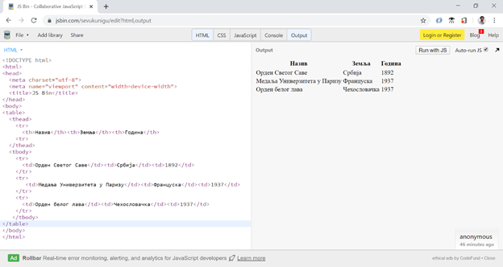

Табеле
======

Поред обичног текста и листи, у веб стране често додајемо и табеле. Сада ћемо научити како то може да се уради и који *HTML* елементи се користе за то.

**Табеле** представљају податке организоване у облику редова и колона.

Први ред у табели садржи називе колона и назива се **заглавље** (енгл. *heading*) табеле. Испод овог реда се налазе редови који садрже податке у својим **ћелијама** (енгл. *cells*).

Табела је сложени *HTML* елемент, који садржи више других елемената различитих врста. *HTML* елементи садржани у табели представљају различите делове табеле (заглавље, остали редови, ћелије):

- Цела табела је окружена ознакама ``<table>`` и ``</table>``. Унутар сваке табеле се налазе заглавље (између ознака ``<thead>`` и ``</thead>``) и **тело** (између ознака тагова ``<tbody>`` и ``</tbody>``). Унутар заглавља и тела се налазе **редови**.

.. code-block:: html

    <table>
        <thead>
            ...
        </thead>
        <tbody>
            ...
        </tbody>
    </table>

- Сваки ред је окружен таговима ``<tr>`` и ``</tr>`` (енгл. *table row*) и у њему се налазе ћелије колона табеле.
- Први ред садржи ћелије заглавља табеле (енгл. *table heading*), где се текст налази између ознака ``<th>`` и ``</th>`` (енгл. *table heading*) и мало je подебљан у односу на текст у осталим ћелијама.

.. code-block:: html

    <thead>
        <tr>
            <th>Назив</th><th>Земља</th><th>Година</th>
        <tr>
    </thead>

- Унутар тела табеле (<tbody>), редови имају ћелије табеле окружене ознакама <td> и </td>.

.. code-block:: html

    <tbody>
        …
        <tr>
            <td>Орден Светог Саве</td><td>Србија</td><td>1892</td>
        </tr>
        …
    </tbody>

- Опционо се може додати и **подножје** (енгл. *footer*) између тагова ``<tfoot>`` и ``</tfoot>`` и **поднаслов** табеле (енгл. *caption*), између ознака ``<caption>`` и ``</caption>``.

Табела која приказује ордење које је добио Никола Тесла и која има три колоне и три реда је приказана у следећем примеру:

.. code-block:: html

    <table>
        <thead>
            <tr>
                <th>Назив</th><th>Земља</th><th>Година</th>
            <tr>
        </thead>
        <tbody>
            <tr>
                <td>Орден Светог Саве</td><td>Србија</td><td>1892</td>
            </tr>
            <tr>
                <td>Медаља Универзитета у Паризу</td><td>Француска</td><td>1937</td>
            </tr>
            <tr>
                <td>Орден белог лава</td><td>Чехословачка</td><td>1937</td>
            </tr>
        </tbody>
    </table>

Ако овај *HTML* текст копирамо у `<https://jsbin.com/?html,output>`_, можемо да видимо како ће табела изгледати у прегледачу:

